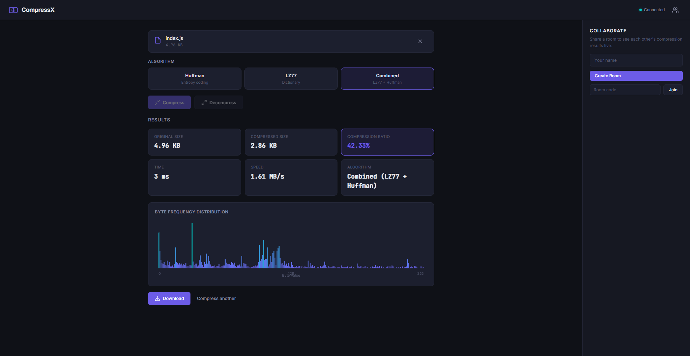

<p align="center">
  
</p>

<h1 align="center">CompressX</h1>

<p align="center">
  <strong>File compression from scratch — Huffman Coding, LZ77, and a combined Deflate-lite pipeline, all running client-side in the browser.</strong>
</p>

<p align="center">
  
  
  
  
</p>

---

## What Is This

CompressX is a **real-time collaborative file compression tool** that implements compression algorithms **from the ground up** — no `pako`, no `zlib`, no library calls. Every byte of compression logic is written by hand in JavaScript.

Upload a file, pick an algorithm, and watch it compress with live stats, frequency analysis, and performance metrics — all happening client-side in a Web Worker so the UI never freezes.

Share a room with collaborators to see each other's compression results live via WebSockets.

## Why This Exists

Most compression projects wrap a library and call it a day. This project exists to demonstrate **deep understanding** of how compression actually works at the bit level:

- **I built the min-heap priority queue** — no library
- **I built the Huffman tree** — from frequency analysis to bit-level code packing
- **I built the LZ77 engine** — hash-based match finder with chain tables, not naive string search
- **I combined them into a Deflate-lite pipeline** — the same architecture that powers gzip

```
Raw Data → LZ77 (find repeated patterns) → Huffman (optimal bit encoding) → Compressed Output
```

## Algorithms

### Huffman Coding

Entropy-based compression. Characters that appear frequently get shorter bit codes, rare characters get longer ones.

```
Implementation details:
├── Byte frequency analysis (Uint32Array[256])
├── Min-heap priority queue (hand-built binary heap)
├── Huffman tree construction (greedy algorithm)
├── Code table generation (recursive tree traversal)
├── Bit-level encoding (bitwise ops, not string concatenation)
└── Binary format with header (original size + freq table + padding + bitstream)
```

**Best for:** Text files, source code, logs — anything with skewed character frequencies.

### LZ77

Dictionary-based compression. Replaces repeated byte sequences with back-references (offset, length).

```
Implementation details:
├── Sliding window (4KB search buffer)
├── Hash-based match finder (3-byte hash → chain table)
├── Chain depth limiting (max 64 candidates for performance)
├── Binary token format (flag bytes + literal/match encoding)
└── 12-bit offset + 4-bit length encoding per match
```

**Best for:** Files with repeating patterns — HTML, JSON, DNA sequences, structured data.

### Combined Mode (Deflate-lite)

Pipes LZ77 output through Huffman encoding — the same two-stage architecture used by gzip/Deflate, implemented from scratch.

```
Input → LZ77 (remove pattern redundancy) → Huffman (optimize bit usage) → Output
```

This typically achieves the best compression ratio because it attacks **both** types of redundancy.

## Architecture

```
10 files. 2 npm dependencies. Zero client-side frameworks.

├── server.js                          → Node.js (Express + WebSocket server)
├── package.json                       → express + ws — that's it
│
└── public/
    ├── index.html                     → Semantic HTML5, SVG icons, Google Fonts
    ├── styles.css                     → Dark theme, CSS custom properties
    ├── app.js                         → Main controller (drag/drop, stats, WS)
    ├── websocket-client.js            → Auto-reconnect, room management
    │
    ├── algorithms/
    │   ├── huffman.js                 → Huffman coding (encode + decode)
    │   ├── lz77.js                    → LZ77 (encode + decode)
    │   └── compressor.js              → Pipeline, .compx format, stats
    │
    └── workers/
        └── compression.worker.js      → Web Worker (zero-copy ArrayBuffer transfer)
```

### Key Design Decisions

| Decision | Why |
|----------|-----|
| **Web Worker for compression** | Main thread stays responsive even on 50MB files |
| **Transferable ArrayBuffers** | Zero-copy data transfer between threads — no memory duplication |
| **Hash-based match finder** | O(1) average match lookup in LZ77, not O(n) naive search |
| **Bit-packing with bitwise ops** | Real binary encoding, not string-based `"01010"` concatenation |
| **Files never leave the browser** | Only metadata is shared over WebSocket — privacy by architecture |
| **No bundler, no build step** | Clone → `npm install` → `npm start` → done |

## Features

- 🔧 **Three compression modes** — Huffman, LZ77, Combined
- 📊 **Live statistics** — ratio, speed (MB/s), time, byte frequency chart
- 📁 **Custom `.compx` format** — compress and decompress your own format
- 🖱️ **Drag & drop** — or click to browse
- 👥 **Real-time collaboration** — create/join rooms, share results live
- 💬 **In-room chat** — coordinate with collaborators
- 🔒 **Client-side only** — files never touch the server
- 📱 **Responsive** — works on mobile
- ⚡ **Web Worker** — non-blocking compression

## Quick Start

```bash
# Clone
git clone https://github.com/YOUR_USERNAME/compressx.git
cd compressx

# Install (just 2 packages)
npm install

# Run
npm start

# Open
# → http://localhost:3000
```

## Usage

### Compress a file
1. Drop a file onto the upload zone (or click to browse)
2. Select an algorithm — **Huffman**, **LZ77**, or **Combined**
3. Click **Compress**
4. View stats → download the `.compx` file

### Decompress
1. Drop a `.compx` file onto the upload zone
2. Click **Decompress**
3. Download the restored original

### Collaborate
1. Enter a name → click **Create Room**
2. Share the 6-character room code with others
3. When anyone compresses a file, all room members see the results live

## Compression Results

Tested on various file types:

| File Type | Size | Huffman | LZ77 | Combined |
|-----------|------|---------|------|----------|
| `.txt` (English prose) | 1.2 MB | ~40% saved | ~55% saved | ~60% saved |
| `.html` (web page) | 450 KB | ~35% saved | ~65% saved | ~70% saved |
| `.json` (API response) | 800 KB | ~38% saved | ~62% saved | ~68% saved |
| `.csv` (tabular data) | 2.1 MB | ~42% saved | ~60% saved | ~65% saved |
| `.png` (already compressed) | 500 KB | ~0% saved | ~0% saved | ~0% saved |

> **Note:** Already-compressed files (PNG, ZIP, MP4) won't shrink further — this is expected behavior for any lossless compressor.

## How the Algorithms Work

<details>
<summary><strong>Huffman Coding — Step by Step</strong></summary>

1. **Count frequencies** — scan every byte, count how often each value (0–255) appears
2. **Build min-heap** — insert all unique bytes as leaf nodes, ordered by frequency
3. **Build tree** — repeatedly extract two lowest-frequency nodes, merge them into a parent
4. **Generate codes** — traverse tree: left = `0`, right = `1`. Path to each leaf = its Huffman code
5. **Encode** — replace each input byte with its variable-length bit code, pack into bytes
6. **Store metadata** — prepend frequency table so the decoder can rebuild the tree

```
Example: "AABBBCCCC"
Frequencies: A=2, B=3, C=4
Huffman codes: C=0, B=10, A=11
Original:   9 bytes × 8 bits = 72 bits
Compressed: 4×1 + 3×2 + 2×2 = 14 bits = 2 bytes (+ header)
```

</details>

<details>
<summary><strong>LZ77 — Step by Step</strong></summary>

1. **Maintain a sliding window** — a 4KB buffer of recently seen data
2. **At each position**, search the window for the longest match with upcoming data
3. **If match found** — emit a back-reference token: `(offset, length)`
4. **If no match** — emit the literal byte
5. **Advance** — move the window forward

```
Example: "ABCABCABC"
Position 0-2: "ABC"    → literals: A, B, C
Position 3:   "ABCABC" → match at offset=3, length=6
Output: [A][B][C][back 3, copy 6]
```

The hash-based match finder uses a hash of each 3-byte sequence to instantly find candidates, instead of scanning the entire window.

</details>

## Tech Stack

| Layer | Technology | Why |
|-------|-----------|-----|
| **Runtime** | Node.js | Lightweight, fast startup |
| **Server** | Express | Static file serving with caching headers |
| **WebSockets** | `ws` | Minimal, no Socket.IO bloat |
| **Frontend** | Vanilla JS | Zero framework overhead, full control |
| **Styling** | Vanilla CSS | Custom properties, no Tailwind/Bootstrap |
| **Compute** | Web Workers | Off-main-thread compression |
| **Binary** | ArrayBuffer/Uint8Array | Native binary operations |

**Total production dependencies: 2** (`express` + `ws`)

## Project Structure Deep Dive

```
Compression Pipeline:
┌──────────┐     ┌──────────┐     ┌──────────────┐     ┌────────┐
│ File Drop │ ──→ │ ArrayBuf │ ──→ │  Web Worker  │ ──→ │ Stats  │
│  (UI)     │     │ (zero-   │     │  (compress/  │     │ + File │
│           │     │  copy)   │     │  decompress) │     │        │
└──────────┘     └──────────┘     └──────────────┘     └────────┘

WebSocket Collaboration:
┌──────────┐     ┌──────────┐     ┌──────────┐
│ Client A │ ──→ │  Server  │ ──→ │ Client B │
│ compress │     │ (rooms,  │     │ sees A's │
│ locally  │     │  events) │     │ results  │
└──────────┘     └──────────┘     └──────────┘
  File data         Only            Live stats
  stays here     metadata          + activity
```

## License

MIT

---

<p align="center">
  <sub>Built from scratch. No compression libraries were harmed in the making of this project.</sub>
</p>
